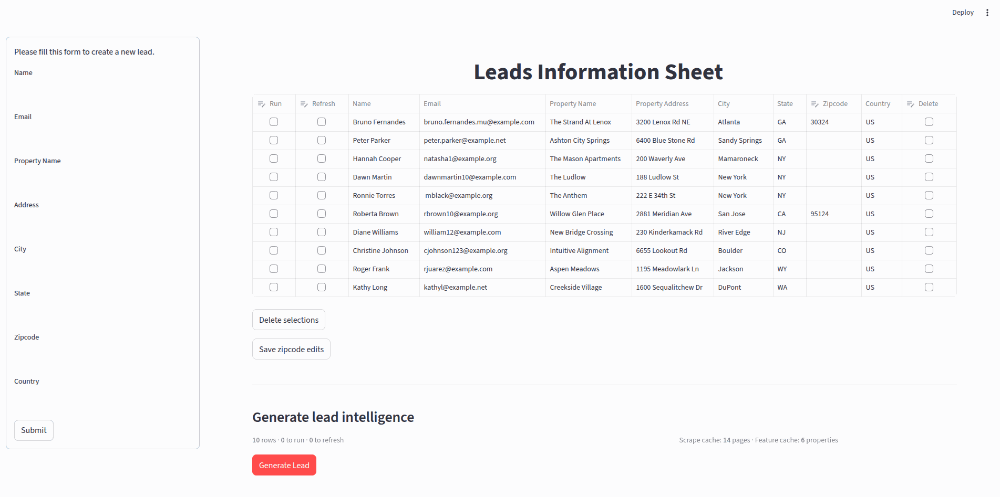
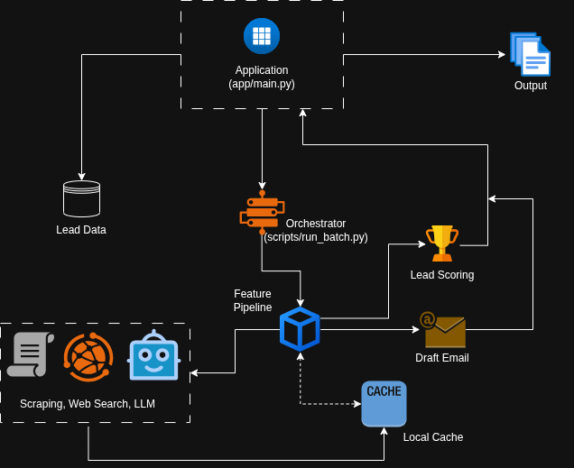

# Lead Scoring Automation For Sales

Tools for GTM lead intelligence: enrich property leads, score them, draft outreach emails, and review results in a Streamlit app.

<p align="center">
    
</p>

<p align="center">
    
</p>

## Requirements

- Python 3.10+
- API keys for external services (see below)

## Installation

1. Clone the repository and open the project directory.

2. Create and activate a virtual environment:

   ```bash
   python3 -m venv .venv
   source .venv/bin/activate   # Windows: .venv\Scripts\activate
   ```

3. Install dependencies:

   ```bash
   pip install -r requirements.txt
   ```

The pinned `requirements.txt` may include packages from a full environment.

## Environment variables (`.env`)

The app loads variables from a **`.env` file in the project root** when you start Streamlit (`load_dotenv()` in `app/main.py`).

| Variable | Used for |
|----------|-----------|
| `GOOGLE_API_KEY` | Gemini via LangChain (`FeaturePipeline`: features, scoring, email drafting) |
| `FIRECRAWL_API_KEY` | Firecrawl client (`clients/firecrawl_client.py`) |

Example shape (use your real keys locally):

```env
GOOGLE_API_KEY=your-key
FIRECRAWL_API_KEY=your-key
```

U.S. Census HTTP APIs in `clients/census_client.py` do not require a key for this project.

## Run the app

From the **repository root** (so `app` and `scripts` resolve on `PYTHONPATH`):

```bash
streamlit run app/main.py
```

For a quick test, try `data/sample_input.csv` in the UI.

## Project layout

| Path | Role |
|------|------|
| `app/main.py` | Streamlit UI (“Leads Information Sheet”) |
| `domain/scoring.py` | Lead scoring |
| `services/` | Feature pipeline, LLM helpers, email drafter, enrichments |
| `clients/` | Firecrawl, census, caches |
| `scripts/run_batch.py` | Per-row processing pipeline |
| `schemas/` | Pydantic models |
